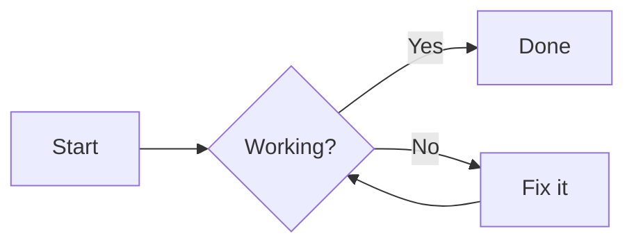

# Mermaid-MD Pro

A lightweight, browser-based Markdown editor with real-time Mermaid diagram rendering, smart navigation, and professional PDF export capabilities.

## Features

* **Live Preview**: Real-time rendering of Markdown and Mermaid.js diagrams.
* **Intelligent TOC**: Automatically generated, floating Table of Contents with smooth-scroll navigation.
* **Duplicate Header Support**: Smart ID generation handles multiple headings with the same name without breaking links.
* **Mermaid Integration**: Supports Flowcharts, Sequence Diagrams, Gantt charts, and more with customizable themes.
* **Dual-Pane IDE**: Resizable editor and preview panes with synchronized scrolling.
* **Export Options**:
* **Download .md**: Save your work locally.
* **Print to PDF**: Optimized CSS for high-quality, multi-page document export.
* **Copy HTML**: Quickly grab the rendered code for use in other apps.


* **Auto-Save**: Your progress is automatically saved to your browser's local storage.

---

## Technology Stack

* **HTML5/CSS3**: Custom layout with Print-engine optimization.
* **JavaScript (ES6)**: Pure vanilla JS for performance and low overhead.
* **Mermaid.js**: For high-fidelity diagram rendering.
* **Local Storage API**: For persistent data between sessions.

---

## Project Structure

```text
mermaid-md-pro/
├── index.html    # Application structure and toolbar
├── style.css     # Dark-themed UI and Print-media rules
└── script.js    # Markdown parser, TOC logic, and event handlers

```

---

## Usage Tips

### Mermaid Syntax

To create a diagram, wrap your code in triple backticks followed by `mermaid`:



### Keyboard Shortcuts & Snippets

* **H2**: Quickly insert second-level headers.
* **Bold**: Wrap text in bold markdown syntax.
* **Flowchart/Sequence**: Drop-in templates for common diagram types.

### Exporting to PDF

When using **Print to PDF**, ensure you enable **"Background Graphics"** in your browser's print settings to ensure colors and diagram lines render correctly.

---

## Installation

1. Clone this repository or download the source files.
2. Open `index.html` in any modern web browser.
3. No server or `npm install` required!

---
